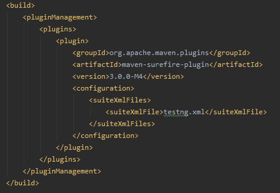

# MTTPP_Projekt

# Testing of a gothic merchandise webshop

## Introduction

This project is made up of tests testing a merchandise shop. It was made for the purpose of an assignment for 
the Methods and Techniques of Software Testing course at the Faculty of Electrical Engineering, Computer Science and Information Technology Osijek.
This repository is used in educational purpuses only.

It uses the following libraries:

* [TestNG](https://testng.org/doc/) - testing framework inspired by JUnit and NUnit
* [Selenium](https://selenium.dev/) - free automated testing suite

## Setup
### 1. Installing IntelliJ

First we need to download and install [IntelliJ IDEA](https://www.jetbrains.com/idea/), a Java integrated development suite
You can download the free community version of IntelliJ, but if you are a student or a professor, you can sign up for a free year
of its ultimate edition.

### 2. Adding JDK into Path

First, you have to download [SDK](https://jdk.java.net/13/).
Second, you need to extract the .zip archive somwhere on your PC.
To add JDK to the Path variable follow this steps:
* Open "This PC"
* Right click inside the window and click on "Properties"
* In the new window click on "Advanced system settings"
* In the advanced tab of the new window click on the "Environment Variables" button
* In the System variables list, find the Path variable
* Click on the it, and when it's highlighted press the "Edit..." button
* Browse and find the bin folder of the downloaded JDK( eg. C:\Program Files\Java\jdk-13.0.2\bin)
* When the bin directory is selected press OK
* Reboot your PC if needed

Open CMD and type "java -version" to check if JDK was correctly added to the Path.
If it isn't you will get an error message, otherwise it will list the version of the JDK added.
When it's added to the path, IntelliJ will automatically recognize it.

### 3. Adding Maven to Path

Download [Maven](https://maven.apache.org/download.cgi)  and unpack it. Adding it to path is the same process as adding the JDK, other than browsing for the Maven bin.

Now go to CMD and type in "mvn -version" command.
If you added it to path correctly you will get a similar message as when checking java

## Creating a Maven Project

Now you will have to make a Maven project.

1. Run Intellij IDEA 
2. Click "Create New Project"
3. Click on Maven on the left side. If the right version of JDK is selected press Next. If it isn't, you'll have to click on the "New..." button next to the SDK label. Now find and select the bin directory of your JDK and press OK. After that, click "Next".
4. Type in your Group Id and Artifact Id.
5. Click "Next".
6. Click "Finish".

Your project is now being created. 

When it is completed, you will see a pop up window asking about dependency imports. You should click on Enable Auto Import.

## Adding dependecies

Open the pom.xml file.

All dependencies need to be located between the tags "<"dependecies">" and "</"dependecies">". Whenever you add a dependency between those tags, because of the enabled auto import they will be imported automatically.

### 1. Selenium dependency

To add [Selenium dependecy](https://mvnrepository.com/artifact/org.seleniumhq.selenium/selenium-java), go to the site and pick a version of the dependency. Copy it and paste it between the aforementioned tags.

### 2. Adding WebDriver Manager dependecy

To add [Webdriver Manager dependecy](https://mvnrepository.com/artifact/io.github.bonigarcia/webdrivermanager), go to the site and do the same as for Selenium.

### 3. Adding Maven Surefire dependecy

To add [Maven Surefire dependency](https://mvnrepository.com/artifact/org.apache.maven.surefire/surefire-api), go to the site and do the same as for Selenium.

### 4. Adding TestNG dependecy

To add [TestNG dependecy](https://mvnrepository.com/artifact/org.testng/testng), go to the site and do the same as for Selenium.

## Adding Maven Surefire Plugin dependecy for a surefire report

To add the Maven Surefire Plugin, you need to make a test class in your project. Add a class to src/test/java. 
You also need to add a new file called testng.xml into your project directory.

The testng file must contain the suite for the tests and its name, the name for the tests, and the name of the class which contains the code for testing. That's the same class you added to the project earlier.

To add the surefire plugin, type this code in the pom.xml file outside of the dependencies tags.

Now everything is set up. Write your tests in the java class and you can generate reports based on them.

## Using the WebDriver Manager

To use the WebDriver manager, you need to instantiate an object from it and configure it,
It's best to configure it in a setup method with the @BeforeMethod annotation so it is configured before each test that you run.

## Generating Surefire report

To generate the Surefire reports, you need to run the tests using maven from the command prompt.
To do that, run cmd, and go to the directory of your project. When within the project directory input the command mvn test.
The tests should run, and when they are finished, the reports will be available in the target folder in your project directory.
